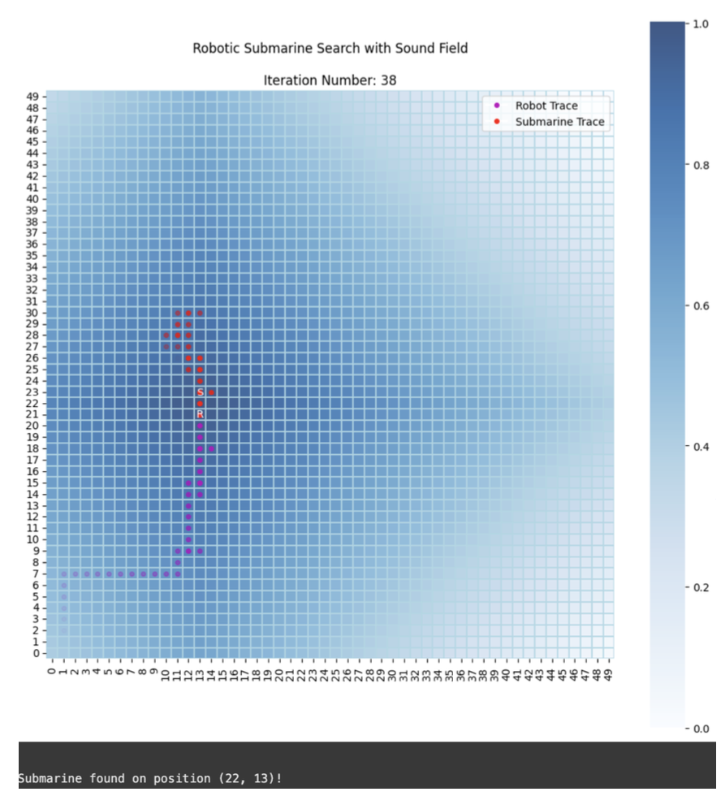

# Bayesian-Search-and-Robotics-Locating-a-Lost-Submarine

In this scenario, a robot is tasked with locating a lost USSR submarine. Using a Bayesian model, the robot continuously updates its beliefs about the submarine's location by integrating real-time data gathered from the sound field emitted by the submarine. As the robot moves through the search area, it updates its probability distribution of the submarine's position, leveraging acoustic signals to refine its search strategy.

Report includes all statistical aspects of the model as well test of the model at the very end.

